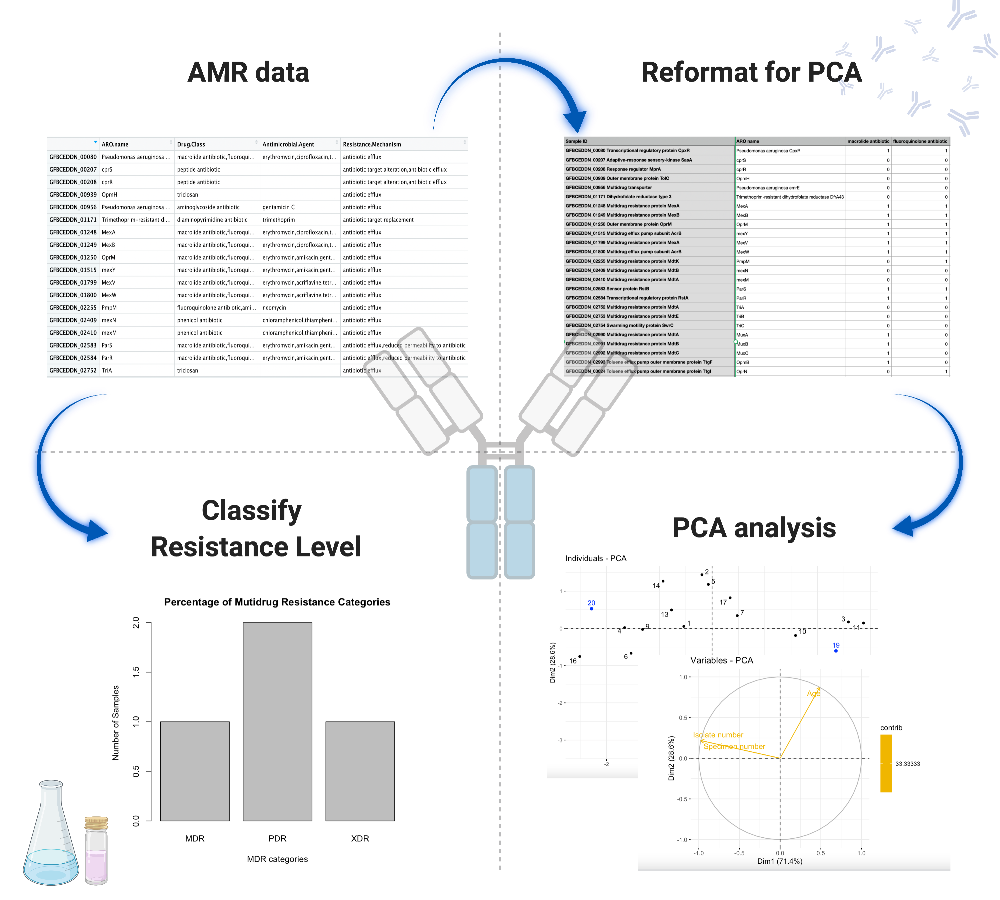

<!-- README.md is generated from README.Rmd. Please edit that file -->

# MDRClassifier

<!-- badges: start -->
<!-- badges: end -->

The MDRClassifer is the tool for classifying and analyzing the
multi-drug resistance (MDR) of pathogen isolates. Three categories
define by European Centre for Disease Prevention and Control: MDR, XDR,
PDR, are used for classifying the MDR of isolates. This package provides
users with a better understanding of the level of multi-drug resistance
of isolates by categorize multi-drug resistance from antimicrobial
agents. Two criteria are available for different user input. If all the
antimicrobial agents are tested, this tool classifies the MDR categories
by the criterion of European Center for Disease Prevention and Control
(ECDC). Otherwise, a more specific criterion from ECDC’s subdivision is
used. The R version is R 4.1.1 and the platfrom is macOs Big Sur.

## Installation

You can install the released version of MDRClassifier from
[CRAN](https://CRAN.R-project.org) with:

``` r
require("devtools")
devtools::install_github("Cloris2000/MDRClassifier", build_vignettes = TRUE)
library("MDRClassifier")
```

## Overview

``` r
ls("package:MDRClassifier") 
data(package = "MDRClassifier")
```

MDRClassifier is an R package developed to classify and analyze
multi-drug resistance (MDR) of bacteria isolates. The package is
targeted for bioinformatics exploring multi-drug resistance of
pathogens. Three categories define by European Centre for Disease
Prevention and Control: MDR, XDR, PDR, are used for classifying the
multi-drug resistance level of .MDR stands for non-susceptibility to at
least one agent in three or more antimicrobial categories. XDR
represents that the isolate is non-susceptibility to at least one agent
in all but less than or equal to 2 antimicrobial categories. PDR means
the isolate is non-susceptibility to all agents in all antimicrobial
categories. The main function **classifyAllMDR** classifies the
multi-drug resistance level of isolates. The function **classifyMDR**
returns the multi-drug resistance level of a specific isolate given the
Sample ID. The function **classifyMDRfromRSI** generates the MDR
category of specific sample from RSI table, which is commonly used in
antibiotic resistance analysis. The function **classifyallMDRfromRSI**
produce a dataframe with sample ID and their corresponding MDR
categories from RSI table. The function **MDRPlot** plots the isolates
by their categories of multidrug resistances. Function **predictAMR** is
available to calculate PCA value of new isolates. Function **plotPCA**
is to generate dimension reduction plot for clustering and predict
relationships of new isolates. For more information, see details below.

``` r
browseVignettes("MDRClassifier")
```

An overview of the package is illustrated below.


## Contributions

The author of the package is Xiaolin Zhou. The ***MDRPlot*** function
makes use of the ***graphic*** R package. The ***classifyMDR*** function
uses ***hash*** package generates a hash object for storing information.
The ***predictAMR*** and ***plotPCA*** utilize ***factoextra*** pacakge
to do principle component analysis.

## References

Berends, M. S., Luz, C. F., Friedrich, A. W. et al. (2021). Data sets
for download / own use. AMR(for R).
<https://msberends.github.io/AMR/articles/datasets.html>

Kassambara, A. (2017). Principal Component Analysis in R: prcomp vs
princomp. Articles - STHDA.
<http://www.sthda.com/english/articles/31-principal-component-methods-in-r-practical-guide/118-principal-component-analysis-in-r-prcomp-vs-princomp/>

R Core Team (2021). R: A language and environment for statistical
computing. R Foundation for Statistical Computing, Vienna, Austria.
<https://www.R-project.org/>

BioRender. (2020). Image created by Zhou, X. Retrieved November 12,
2021, from <https://app.biorender.com/>

Wickham et al., (2019). Welcome to the tidyverse. Journal of Open Source
Software. <https://doi.org/10.21105/joss.01686>

Wickham H (2016). ggplot2: Elegant Graphics for Data Analysis.
Springer-Verlag New York.https://ggplot2.tidyverse.org.

Wickham, H. and Bryan, J. (2019). R Packages (2nd edition). Newton,
Massachusetts: O’Reilly Media. <https://r-pkgs.org/>

## Acknowledgements

This package was developed as part of an assessment for 2021 BCB410H:
Applied Bioinformatics, University of Toronto, Toronto,CANADA.
