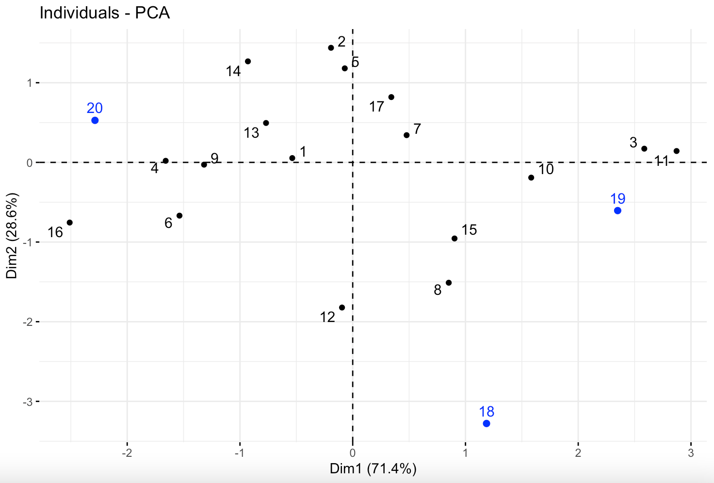

```{r setup, include = FALSE}
library(knitr)
opts_chunk$set(fig.align = "center", 
               out.width = "90%",
               fig.width = 6, fig.height = 5.5,
               dev.args=list(pointsize=10),
               par = TRUE, # needed for setting hook 
               collapse = TRUE, # collapse input & ouput code in chunks
               warning = FALSE)
knit_hooks$set(par = function(before, options, envir)
  { if(before && options$fig.show != "none") 
       par(family = "sans", mar=c(4.1,4.1,1.1,1.1), mgp=c(3,1,0), tcl=-0.5)
})
set.seed(1) # for exact reproducibility
```

## Introduction

`MDRClassifier` is an R package developed to analyze and classify multidrug resistance (MDR) of protein sequences. The package is targeted for bioinformatics exploring mutidrug resistance of species. Three categories define by European Centre for Disease Prevention and Control: MDR, XDR, PDR, are used for classifying the MDR of protein sequences. The main function __*classifyAllMDR*__ classify the multi-drug resistance level of isolates. The function __*classifyMDR*__ classify the multi-drug resistance level of specific isolate given the Sample ID.  The function __*MDRPlot*__ (under construction) plot the isolates by their categories of multidrug resistances. Function __*MDRClassifierGenerator*__ (under construction) is available to generate simlulation data.  For more information, see details below. **This document gives a tour of MDRClassifer (version 0.1.0)**. It was written in R Markdown, using the [knitr](https://cran.r-project.org/package=knitr) package for production. See `help(package = "MDRClassifier")` for further details. 

See `help(package = "MDRClassifier")` for further details and references provided by `citation("MDRClassifier")`.To download **MDRClassifier**, use the following commands:

``` r
require("devtools")
install_github("Cloris2000/MDRClassifier", build_vignettes = TRUE)
library("MDRClassifier")
```
To list all sample functions available in the package:
``` r
ls("package:MDRClassifier")
```

To list all sample datasets available in the package:
``` r
data(package = "MDRClassifier")
```
<br>


## Available Datasets
There are two datasets and five functions in this package.
<br>
__1. DrugResistance__ is the dataset for classifying multi-drug resistance category.
There are 117,967 rows and 4 columns in total. Each row represents the sample ID of isolates. Columns are predicted antibiotic resistance genes, Drug class, Antimicrobial agents, and resistance mechanism from RGI package.
<br>
__2. pca_data__ is the dataset for Principle Component Analysis (PCA) to cluster the samples and predict antimicrobial resistance. There are 500 rows and 53 columns. Each row represents one sample, and each column stands for one feature of clinical trails.
<br>

## Available Functions
 __1.classifyMDR__
 When user provide specific sample ID of isolate, this function classify the    multi-drug resistance by finding the corresponding antimicrobial category and
 use the number of category to classify the multi-drug resistance level: MDR, XDR,  PDR. See example with 
```r
 #require("MDRClassifier")
 #Using DrugResistance dataset available with package
 data <- MDRClassifier::DrugResistance
 category <- MDRClassifier::classifyMDR(drug_resistance = data,
                                sample_ID = "GFBCEDDN_00939",
                               antimicrobial_agents = "Antimicrobial.Agent")
 # To obtain value from results
 category
```
  <br>
  
__2.classifyAllMDR__
This function classifies  the multi-drug resistances of all samples in the dataframe given the all drug resistances information from RGI prediction. A sample can be generated by:
```r
require(MDRClassifier)
#Using DrugResistance dataset available with package
data <- MDRClassifier::DrugResistance
category_result <- MDRClassifier::classifyAllMDR(drug_resistance = DrugResistance,
                               antimicrobial_agents = 'Antimicrobial.Agent')
#To obtain value from results
category_result
```
<br>


__3.MDRPlot__
This function takes in a list of dataframes and convert the antimicrobial
resistance level to three categories: MDR, XDR, and PDR. The barplot indicates
the percentage of MDR, XDR, and PDR isolates in the data. A sample barplot can be produced by:
```r
require("MDRClassifier")
x <- data.frame(Sample_ID = c("1","2","3","4","5","6"),
                 Category = c("MDR", "PDR", "NULL", "XDR", "PDR", "NULL"))
#Obtain plot by
MDRClassifier::MDRPlot(x)
```

 <div style="text-align:center">
 <div style="text-align:left">
 
 The x-axis represents the number of samples in each category, and the y-axis 
 represents three multi-drug resistance category: MDR, XDR, PDR.
<br>

__4.predictAMR__
This function calculates new samples's PCA value.
#' to show the new sample's in the original cluster
#Using pca_data available with package
```r
pca_value <- MDRClassifier::predictAMR(pca_data[c(1:17), c(2,9,16)], pca_data[c(18:20),        c(2,9,16)])
#to get result
pca_value
```

__5.plotPCA__
This function cluster and predicts multi-drug resistance by principle component analysis (PCA) to show the new sample's in the original cluster.
```r
#Using pca_data available with package
#to obtain predicted result with new samples
plot_result1 <- MDRClassifier::plotPCA(pca_data[c(1:17), c(2,9,16)], pca_data[c(18:20), c(2,9,16)],"predict")
plot_result1


#to obtain individual PCA result
plot_result2 <- MDRClassifier::plotPCA(pca_data[c(1:17), c(2,9,16)], pca_data[c(18:20), c(2,9,16)],"individual")
plot_result2


#to obtain variable PCA result
plot_result3 <- MDRClassifier::plotPCA(pca_data[c(1:17), c(2,9,16)], pca_data[c(18:20), c(2,9,16)],"variables")
plot_result3
```
 <div style="text-align:center">
 <div style="text-align:left">
 This plot is the example for predicting sample 18, 19, 20. The newly added sample
 is clustered to the original data by PCA value. Sample 20 is more closely related to sample 4, sample 9, and sample 14 in dimension 1 and 2, indicating their similar antimicrobial resistance.

### ECDC Criteria
*European Centre for Disease Prevention and Control (ECDC) criteria to define
antimicrobial resistance into the following categories (Magiorakos et al., 2021):
1. MDR: non-susceptibility to at least one agent in three or more antimicrobial
categories.
2. XDR: non-susceptibility to at least one agent in all but less than or equal to
2antimicrobial categories.
3. PDR: non-susceptibility to all agents in all antimicrobial categories.
*Antimicrobial categories are available from:
http://www.ecdc.europa.eu/en/activities/diseaseprogrammes/ARHAI/Pages/public_consu
ltation_clinical_microbiology_infection_article.aspx.
<br>


<div style="text-align:left">
<br>
<div style="text-align:left">
## Package References

[Zhou, X. (2021) MDRClassifier: A tool for analyzing and classifying multidrug resistance. Unpublished.](https://github.com/Cloris2000/MDRClassifier)

<br>

## Other References

R Core Team (2020). R: A language and environment for statistical computing. R Foundation for Statistical Computing, Vienna, Austria. https://www.R-project.org/

BioRender. (2020). Image created by Silva, A. Retrieved October 30, 2020, from https://app.biorender.com/

Wickham, H. and Bryan, J. (2019). *R Packages* (2nd edition). Newton, Massachusetts: O'Reilly Media. https://r-pkgs.org/

Berends, M. S., Luz, C. F., Friedrich, A. W. et al. (2021). Data sets for download / own use. AMR(for R). https://msberends.github.io/AMR/articles/datasets.html

Kassambara, A. (2017). Principal Component Analysis in R: prcomp vs princomp. Articles - STHDA. http://www.sthda.com/english/articles/31-principal-component-methods-in-r-practical-guide/118-principal-component-analysis-in-r-prcomp-vs-princomp/

BioRender. (2020). Image created by Zhou, X. Retrieved November 12, 2021, from https://app.biorender.com/

Wickham et al., (2019). Welcome to the tidyverse. Journal of Open Source Software.
https://doi.org/10.21105/joss.01686

Wickham H (2016). ggplot2: Elegant Graphics for Data Analysis. Springer-Verlag New York.https://ggplot2.tidyverse.org.

----

```{r}
sessionInfo()
```
